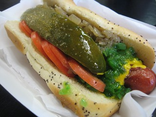
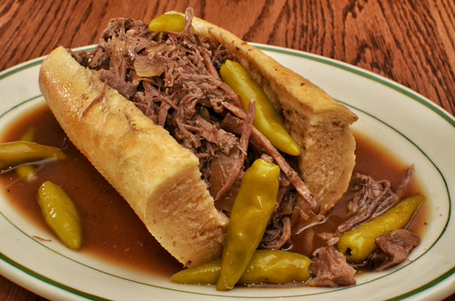

<!DOCTYPE html>
<html lang="en">
<head>
    <meta charset="UTF-8">
    <meta name="viewport" content="width=device-width, initial-scale=1.0">
    <meta name="description" content="Explore Chicago's greatest food rivalries — deep dish vs. thin crust, Polish vs. Chicago Dog, and wet vs. dry Italian beef. Cast your vote!">
    <title>Chicago Food Debates</title>
    <link rel="stylesheet" href="styles.css">
</head>
<body>
<header>
    

        <h1>Chicago Food Debates</h1>
    

    <nav aria-label="Main navigation">
        <ul>
            <li><a href="index.html">Home</a></li>
            <li class="has-dropdown">
                <a href="#">Food Debates</a>
                <ul class="dropdown">
                    <li><a href="pizza.html">Pizza Debate</a></li>
                    <li><a href="sausage.html">Sausage Debate</a></li>
                    <li><a href="beef.html">Beef Debate</a></li>
                </ul>
            </li>
            <li><a href="gallery.html">Restaurants</a></li>
            <li><a href="about.html">About</a></li>
            <li><a href="contact.html">Contact</a></li>
        </ul>
    </nav>
</header>
<main>
    <section class="hero" aria-label="Hero banner">
        
        <h2>Settle It Once and For All</h2>
        
Explore Chicago's greatest food rivalries and cast your vote.

    </section>

    <section class="intro container">
        <h2>Welcome to Chicago Food Debates</h2>
        

            Chicago has always been a city that takes its food seriously. From the corner taverns of the
            South Side to the beef stands tucked under expressways, every neighborhood has its loyalties,
            its legends, and its opinions. And those opinions run deep.
        

        

            This is Chicago Food Debates — your guide to the city's most passionate culinary rivalries.
            We're not here to settle the arguments (okay, maybe a little). We're here to celebrate them.
            Because whether you're a lifelong Chicagoan or a first-time visitor, understanding these debates
            means understanding the city itself.
        

        

            Dive into three of Chicago's greatest food rivalries, explore the history, discover the best
            spots to try them yourself — and just leave the ketchup at home.
        

    </section>

    <section class="teasers">
        <h2>Featured Debates</h2>
        

            <article>
                
                <h3>Thin Crust vs. Deep Dish</h3>
                

                    Tourist icon or local legend? Deep dish put Chicago on the map,
                    but tavern-style is what locals actually eat. Pick your side.
                

                <a href="pizza.html" class="teaser-btn" aria-label="Explore the Pizza Debate">Explore the Pizza Debate</a>
            </article>
            <article>
                
                <h3>Chicago Dog vs. Maxwell Street Polish</h3>
                

                    Garden fresh with a snap, or smoky, garlicky, and gloriously messy?
                    Two iconic sausages, one legendary city.
                

                <a href="sausage.html" class="teaser-btn" aria-label="Explore the Sausage Debate">Explore the Sausage Debate</a>
            </article>
            <article>
                
                <h3>Wet vs. Dry Italian Beef</h3>
                

                    Are you a dipped risk-taker or do you prefer to keep the bread intact?
                    Either way, lean forward — it's going to get messy.
                

                <a href="beef.html" class="teaser-btn" aria-label="Explore the Beef Debate">Explore the Beef Debate</a>
            </article>
        

    </section>
</main>
<footer>
    
&copy; 2026 Chicago Food Debates

</footer>
</body>
</html>
